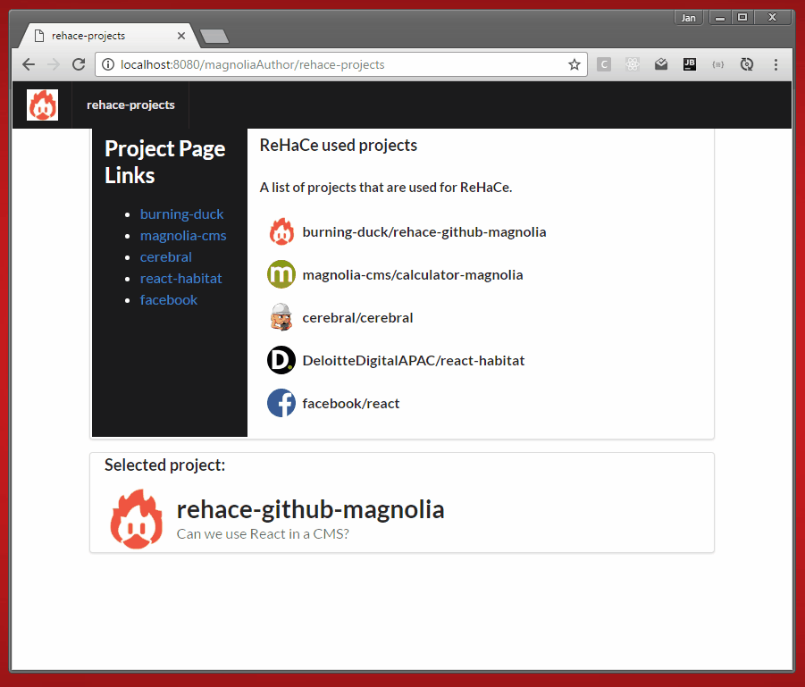
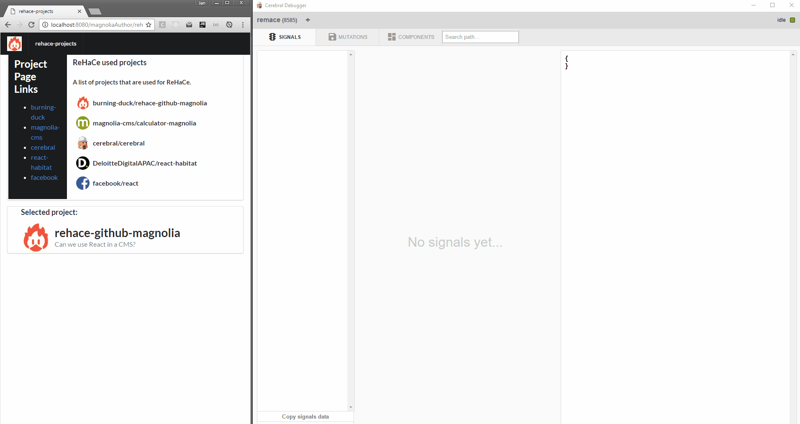

# ReHaCe - Github repository components as magnolia light module.
 
[![Build status][travis-image]][travis-url]


React - Habitat - Cerebral === ReHaCe

- Create Magnolia pages enriched with data from your favorite Github repositories.
- Use React components from server side rendered templates.
- Connect your components to a single state.
- Let your authors choose which React components to show on the page.
- Turn any React component into a Magnolia component.

## Whats inside?

- React - The view.
- Cerebral -  The controller.
- Habitat - Attach React to the DOM.
- Magnolia - The CMS.

If youre creating a React App, the _default_ way is to create a root component and render the whole app in the page.
This is great for single page apps, as you have the full controll in your components.


As an author you use a CMS to have a nice ui/ux to manage your sites and content.
In this case it is the Magnolia CMS with his nice page editing and light modules.


Our goal was it to get this two worlds together.

 

In this demo we connect to the Github API to fetch some repository data.
The basic flow is:

- Create a project page in Magnolia with owner and repository name.
- The page template instantiates the React component:
```html
<div data-component="GithubProjectRegistration"
     data-prop-owner="${content.owner!}"
     data-prop-repo="${content.repo!}">
</div>
```
- The component triggers the signal `projectRegistered`.
- The signal fetches the repository data from github and stores the result in the state.
```javascript
const projectRegistered = [
  createProjectEntry, {
    created: [
      fetchRepoData, {
        success: [
          saveRepoData,
          setProjectAsSelectedIfFirst
        ],
        error: [logError('Could not fecth repo data.')]
      }
    ],
    exists: [noop],
    error: [logError('Could not register project')]
  }
]
```
- The state now contains the repository data.
- Any component on the page can connect to the state and render the data.


## Features

##### ReHaCe github magnolia project list


##### Project list with the cerebral debugger


##### Magnolia author, create the project list


## Usage

## Demo
To see a page demonstrating this components, open the Pages app in Magnolia AdminCentral and import the file _dev/demos/website.rehace-projects.xml (Import it directly at the root of the tree to see an example of the included css styling.)


## Development

### npm run

```
npm run start
```
- clean
- Watch all files in `_dev` for changes.
- Saves build bundles in `webresources`
- Start a livereload server on default port 35729


```
npm run build
```
- clean
- Builds a bundle from `_dev`.
- Saves build bundles in `webreources`


```
npm run clean
```
- Deletes `webresources`


## Information on Magnolia CMS

This directory is a Magnolia 'light module'.
https://docs.magnolia-cms.com


## License
 MIT

## Contributors

- Peter Höffling
- Jan Rösler

## Join us on
- [Discord](https://discord.gg/5KGSrfd)
- [burning-duck.github.io](https://burning-duck.github.io/) (WIP)
- burning.duck.org@gmail.com


[travis-image]: https://img.shields.io/travis/burning-duck/rehace-github-magnolia.svg?style=flat
[travis-url]: https://travis-ci.org/burning-duck/rehace-github-magnolia
