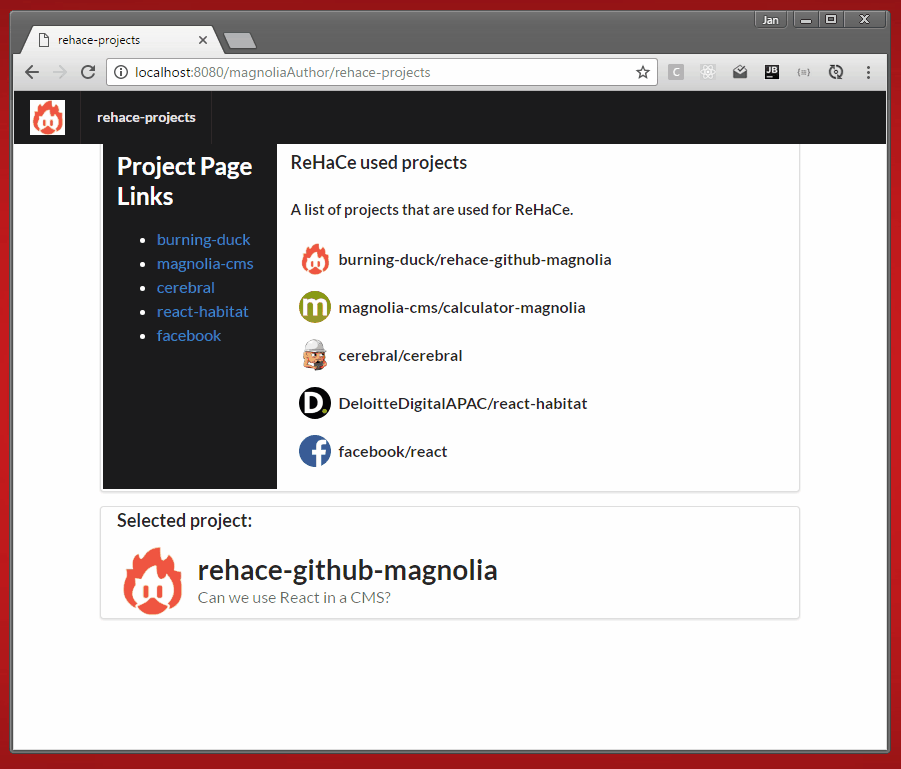
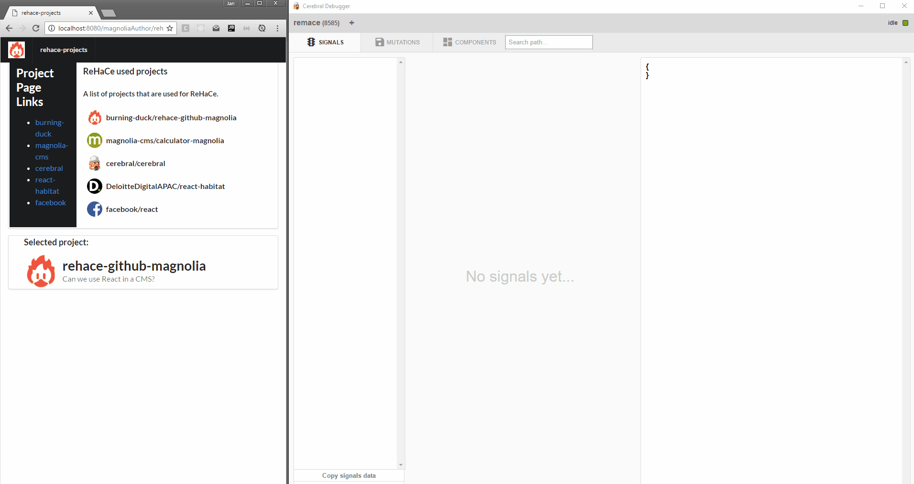

# ReHaCe - Github repository components as magnolia light module.

A sample of how to integrate single-page technologies in a multi-page CMS.
 
[![Build status][travis-image]][travis-url]
 


## Features


<!--
Provide a list of the key features this module provides for content
authors, or whoever the primary user is. For a component template,
consider providing screenshots of the rendered component and the
component dialog.
-->


## Usage


### npm run

```
npm run start
```
- clean
- Watch all files in `_dev` for changes.
- Saves build bundles in `webreources`
- Start a livereload server on default port 35729


```
npm run build
```
- clean
- Builds a bundle from `_dev`.
- Saves build bundles in `webreources`


```
npm run clean
```
- Deletes `webresources`


<!--
Provide details about how a developer can make the component template,
or other features provided by the light module, available to content
authors.

This can include any special instructions about webresources or
availability. This could include instructions on 3rd party dependencies
such as jquery.

Describe how a template can be configured with parameters if
applicable.
-->


## Information on Magnolia CMS

This directory is a Magnolia 'light module'.
https://docs.magnolia-cms.com


## License


## Contributors


[travis-image]: https://img.shields.io/travis/burning-duck/rehace-github-magnolia.svg?style=flat
[travis-url]: https://travis-ci.org/burning-duck/rehace-github-magnolia
